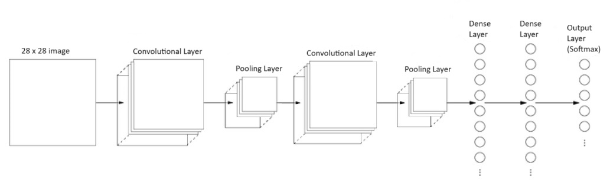

# digit-recognition
**Convolutional Neural Network (CNN) model to recognize handwritten digits (image classification problem).**

 

Using the [MNIST](http://yann.lecun.com/exdb/mnist/) dataset, I created a CNN model that recognizes handwritten digits with an accuracy of **99.64%**. That is, it correctly predicted 4,972 out of 5,000 images.

 

https://github.com/danielsimon4/digit-recognition/assets/155323325/23ecb8be-b0b9-4b69-9557-eef23f1d749d

 

CNN architecture:

References:
- [Nielsen, Michael. (2019). Online Book. *Neural networks and deep learning*](http://neuralnetworksanddeeplearning.com/index.html)
- [TensorFlow. (2020). *Basic classification: Classify images of clothing*](https://www.tensorflow.org/tutorials/keras/classification)
- [NeuralNine. (2023). YouTube. *Modern Machine Learning Apps with Streamlit - No HTML, CSS, JS*](https://www.youtube.com/watch?v=_Syn5SpWgZ0&t=26s)
